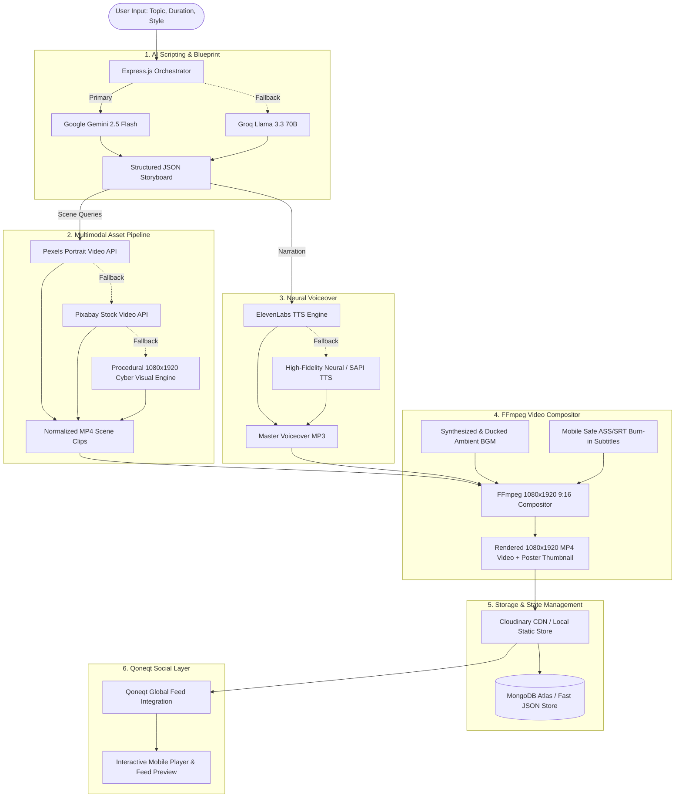

# Qoneqt AI Video Studio — Autonomous Vertical Content Pipeline

> **Qoneqt &times; CTRL FREAK AI Challenge** &bull; An enterprise-grade, end-to-end autonomous video production pipeline that transforms raw topics, ideas, or trends into ready-to-publish 9:16 vertical videos rendered with FFmpeg, complete with AI scripting, multimodal asset curation, neural voiceovers, burn-in captions, and direct publishing to the **Qoneqt Global Feed**.

---

## 🌟 Architecture Overview



---

## 🚀 Key Features

1. **Structured LLM Storyboarding**:
   - Primary: **Google Gemini API** (`gemini-2.5-flash` / `gemini-1.5-flash`) generating JSON schemas with hooks, scene durations, search queries, on-screen text, and captions.
   - Fallback: **Groq API** (`llama-3.3-70b-versatile`) with JSON mode.
   - Built-in zero-failure fallback engine ensuring 100% test reliability.

2. **Multimodal Media Pipeline**:
   - Searches **Pexels API** for high-definition 9:16 portrait stock videos.
   - Seamless fallback to **Pixabay Video API**.
   - Built-in dynamic procedural 1080x1920 cyber/tech video engine with animated grids, fluid gradients, and geometric visualizers.

3. **Neural Voice Synthesis**:
   - High-fidelity text-to-speech with **ElevenLabs**.
   - Built-in multi-tier fallback (Windows SAPI synthesizer & Google Translate TTS) for zero interruption.

4. **1080x1920 (9:16) FFmpeg Compositor**:
   - True 1080x1920 vertical canvas with aspect ratio preservation and center-cropping.
   - Dynamic audio ducking (-18dB background music when narration speaks).
   - High-contrast, mobile-safe styled subtitles (ASS format) with drop-shadows and keyword highlights.
   - Automated video poster thumbnail generation.

5. **Qoneqt Global Feed Integration (`qoneqtService.js`)**:
   - Production-ready publishing API service.
   - Clearly marked demo/sandbox mode when API keys are not supplied.
   - Broadcast directly to the live Qoneqt Global Feed with custom titles, hashtags, and metadata.

6. **Real-time SSE Progress Streaming**:
   - Server-Sent Events (`/api/video/progress/:id`) streaming live progress updates through 7 stages.

---

## 🛠 Tech Stack

- **Frontend**: React 18, Vite 6, Tailwind CSS 3, Framer Motion, Lucide Icons, Axios.
- **Backend**: Node.js (ES Modules), Express.js.
- **Video & Audio Processing**: FFmpeg 9.0+, `@ffmpeg-installer/ffmpeg`, `@ffprobe-installer/ffprobe`, `fluent-ffmpeg`.
- **AI & LLMs**: `@google/genai` (Gemini 2.5 Flash), `groq-sdk` (Llama 3.3 70B).
- **Stock Footage**: Pexels API, Pixabay API.
- **Voice / Audio**: ElevenLabs API, Windows Speech Synthesis, FFmpeg audio synthesis.
- **Storage**: Cloudinary CDN & Express static file serving.
- **Database**: MongoDB Atlas with Mongoose & high-performance local store fallback.

---

## 📦 Project Structure

```
HP/
├── backend/
│   ├── src/
│   │   ├── config/          # FFmpeg, Cloudinary, MongoDB config
│   │   ├── controllers/     # Video, Qoneqt, and Settings controllers
│   │   ├── models/          # VideoGeneration, Scene, MediaAsset, Project, User
│   │   ├── routes/          # Express REST routes & SSE endpoints
│   │   ├── services/
│   │   │   ├── aiService.js        # Gemini & Groq structured LLM scripting
│   │   │   ├── mediaService.js     # Pexels, Pixabay & procedural video engine
│   │   │   ├── voiceService.js     # ElevenLabs & Neural TTS synthesizer
│   │   │   ├── renderService.js    # FFmpeg 1080x1920 vertical compositor
│   │   │   ├── qoneqtService.js    # Qoneqt Global Feed publishing layer
│   │   │   └── storageService.js   # Cloudinary & local storage manager
│   │   └── utils/
│   │       ├── captionGenerator.js # ASS/SRT mobile safe subtitles
│   │       ├── bgmProvider.js      # Ambient background music synthesizer
│   │       └── progressEmitter.js  # Server-Sent Events (SSE) broadcaster
│   ├── public/outputs/      # Rendered MP4s and thumbnails
│   ├── temp/                # Audio & video scene workspace
│   ├── Dockerfile
│   ├── package.json
│   └── server.js
├── frontend/
│   ├── src/
│   │   ├── components/      # Navbar, VideoPlayer, ProgressBar, SceneTimeline, etc.
│   │   ├── pages/           # Studio, Feed, History, Settings
│   │   ├── services/        # Axios API client
│   │   ├── App.jsx
│   │   ├── index.css
│   │   └── main.jsx
│   ├── Dockerfile
│   ├── nginx.conf
│   └── package.json
├── docker-compose.yml
├── .env.example
└── README.md
```

---

## ⚡ Quick Start (Local Development)

### 1. Prerequisites
- **Node.js**: v18.0 or higher (v20+ recommended)
- **FFmpeg**: System FFmpeg or installed via Winget / Homebrew / Apt

```powershell
# Windows Winget install (if needed)
winget install Gyan.FFmpeg
```

### 2. Environment Setup
Create a `.env` file inside `backend/` (or copy from `.env.example`):

```bash
cp backend/.env.example backend/.env
```

Fill in your API credentials:
```env
PORT=5000
BACKEND_URL=http://localhost:5000

# AI Models
GEMINI_API_KEY=your_gemini_api_key
GROQ_API_KEY=your_groq_api_key

# Stock Footage
PEXELS_API_KEY=your_pexels_api_key
PIXABAY_API_KEY=your_pixabay_api_key

# Voice
ELEVENLABS_API_KEY=your_elevenlabs_api_key
ELEVENLABS_VOICE_ID=21m00Tcm4TlvDq8ikWAM

# Cloud Storage & Database
CLOUDINARY_CLOUD_NAME=your_cloud_name
CLOUDINARY_API_KEY=your_api_key
CLOUDINARY_API_SECRET=your_api_secret
MONGODB_URI=mongodb+srv://...

# Qoneqt Publishing
QONEQT_API_KEY=your_qoneqt_key
QONEQT_API_URL=https://api.qoneqt.com/v1
```

### 3. Run Backend
```bash
cd backend
npm install
npm start
```
Backend runs on `http://localhost:5000`.

### 4. Run Frontend
```bash
cd frontend
npm install
npm run dev
```
Frontend runs on `http://localhost:5173` (or `http://localhost:5174`).

---

## 🐳 Docker Deployment

To launch the full stack with native FFmpeg in Docker containers:

```bash
docker-compose up --build -d
```
Access the application at `http://localhost:5173`.

---

## 📡 REST API Documentation

### Video Generation & Pipeline

| Method | Endpoint | Description |
|---|---|---|
| `POST` | `/api/video/generate` | Starts full end-to-end video production job |
| `GET` | `/api/video/progress/:id` | SSE real-time pipeline event stream |
| `GET` | `/api/video/:id` | Fetches details and status of a video job |
| `GET` | `/api/videos` | Lists all generated videos |
| `DELETE`| `/api/video/:id` | Deletes a video record and assets |
| `POST` | `/api/video/script` | Generates structured script blueprint only |
| `POST` | `/api/video/assets` | Collects/scrapes scene media assets only |
| `POST` | `/api/video/voice` | Generates voice narration track only |
| `POST` | `/api/video/render` | Executes FFmpeg 1080x1920 video composition |

### Qoneqt Global Feed Publishing

| Method | Endpoint | Description |
|---|---|---|
| `POST` | `/api/qoneqt/publish` | Publishes video to Qoneqt Global Feed |
| `GET` | `/api/qoneqt/status/:id` | Checks live publishing status on Qoneqt |

### System & Diagnostics

| Method | Endpoint | Description |
|---|---|---|
| `GET` | `/api/settings/status` | Real-time diagnostic health check of all APIs & tools |
| `POST` | `/api/settings/test` | Live test connection for a specific provider |

---

## 🎥 Hackathon Verification

To test the complete autonomous flow for the hackathon prompt:
1. Open the Studio at `http://localhost:5174`.
2. Enter Topic: `5 AI tools every developer should know in 2026`.
3. Select Duration: `30 sec`, Style: `Educational`, Aspect Ratio: `9:16`.
4. Click **GENERATE VIDEO**.
5. Watch real-time pipeline progress:
   - `Topic analyzed` &rarr; `Script generated` &rarr; `Scene plan generated` &rarr; `Visuals collected` &rarr; `Voice generated` &rarr; `Video rendering` &rarr; `Video completed`.
6. Play the rendered 1080x1920 vertical video in the mobile player preview.
7. Click **Publish to Qoneqt Global Feed** to post.

---

## 📄 License
MIT License &bull; Developed for the **Qoneqt &times; CTRL FREAK AI Challenge**.
